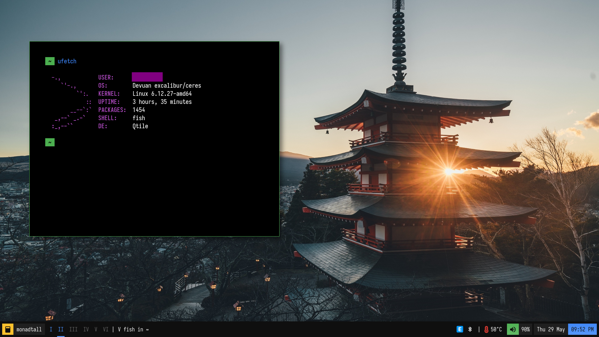

# My personal configuration

This is my current configuration on my computer!

# Window managers

There are current window manager in this config:

- i3 "~/.config/i3"
- qtile "~/.config/qtile"
- awesome "[config file can be found in this separate repository](https://github.com/ltuyen1/awm-config)"

Other configs can be found here:

- Alacritty "~/.config/alacritty"
- fish "~/.config/fish"
- i3status "~/.config/i3status"
- bash "~/.bash"
